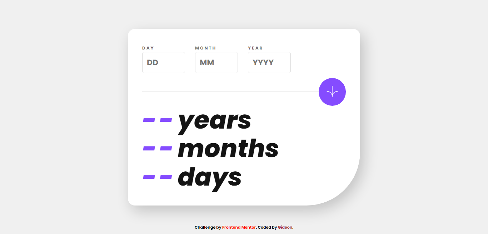

## Welcome! 👋

<div align="center">


# **Front-end Mentor | Age Calculator App**

</div>

## Overview
)

<div align="right">

### :camera: Preview

</div>

#### Desktop Design


#### Mobile Design (Model: Samsumg S20 Ultra)


### :link: Links
- Solution URL: [Add solution URL here](https://your-solution-url.com)
- Live Site URL: [Add live site URL here](https://your-live-site-url.com)

### :pencil: The challenge

The challenge is to build out this age calculator app and get it looking as close to the design as possible.

Also, Users should be able to: 

- View an age in years, months, and days after submitting a valid date through the form :heavy_check_mark:
- Receive validation errors if:
  - Any field is empty when the form is submitted :heavy_check_mark:
  - The day number is not between 1-31 :heavy_check_mark:
  - The month number is not between 1-12 :heavy_check_mark:
  - The year is in the future :heavy_check_mark:
  - The date is invalid e.g. 31/04/1991 (there are 30 days in April) :heavy_check_mark:
- View the optimal layout for the interface depending on their device's screen size :heavy_check_mark:
- See hover and focus states for all interactive elements on the page :heavy_check_mark:

:sparkles: **Bonus**: See the age numbers animate to their final number when the form is submitted :heavy_check_mark:

## My Process

### :hammer_and_wrench: Built with:
- Semantic HTML5 markup
- CSS custom properties
- Javacript
- Desktop First workflow

### :bulb: What I Learned:

- Alot more on animations, and counter
```Javascript
  function animate() {
    let digits = document.querySelectorAll('[data-val]');
    let interval = 1300;
    
    digits.forEach((digit) => {
        let startValue = 0;
        let endValue = Number(digit.innerText); 
        let duration = Math.floor(interval / endValue);
        if (endValue > 0){
            let counter = setInterval(() => {
                startValue += 1;
                digit.textContent = startValue;
                if (startValue == endValue) {
                    clearInterval(counter)
                }
            }, duration);
        }
    })
}
```
- Javascript Date()
- Learnt about markdown. Wrote this MYSELF.

### :books: Useful resources

- [Date ()](https://www.w3schools.com/js/js_date_methods.asp) - This is an amazing article which helped me finally understand date method. I'd recommend it to anyone still learning this concept.
- [Animation and Transition](https://www.youtube.com/watch?v=SgmNxE9lWcY&pp=ygUddHJhbnNpdGlvbnMgYW5kIGFuaW1hdGlvbiBjc3M%3D "Youtube Video") - This is an amazing tutorial to know the basics of animation and transition. EVEN IF YOU ARE A BEGINNER.

## :computer: Author

- Website - [App Calculator](https://www.your-site.com)
- Frontend Mentor - [@Giddero](https://www.frontendmentor.io/profile/GiDDeRo)

## Let's Connect :v:


